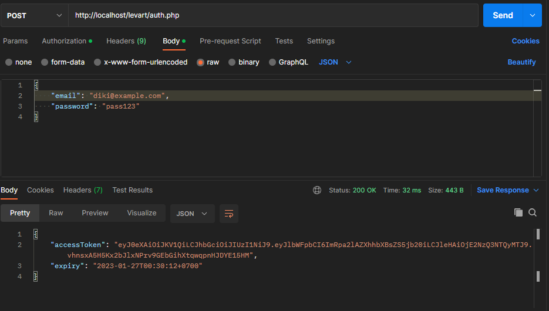
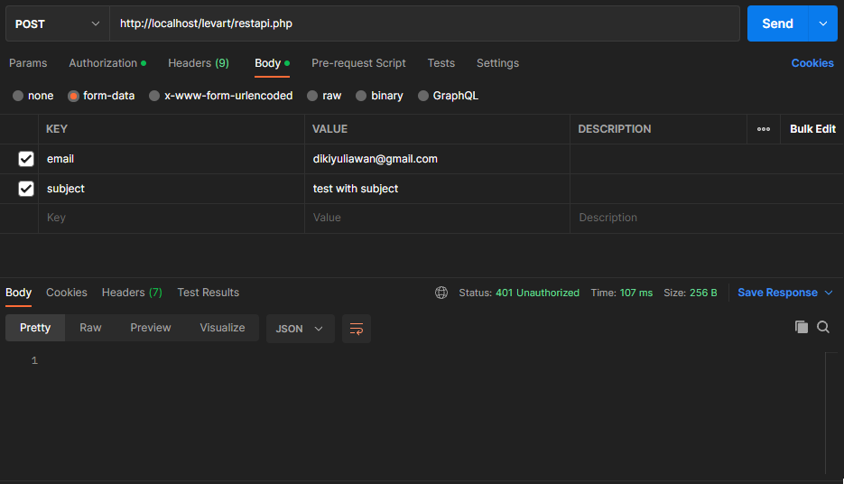
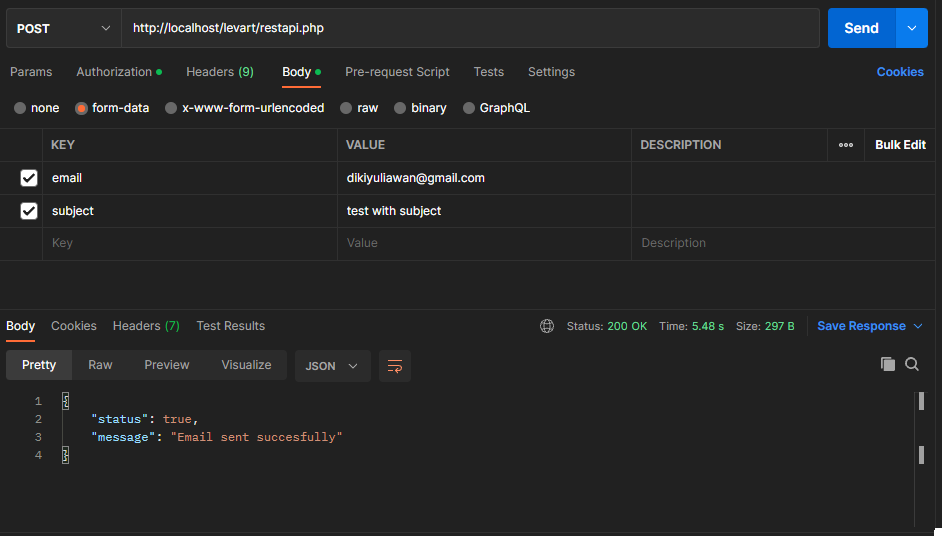
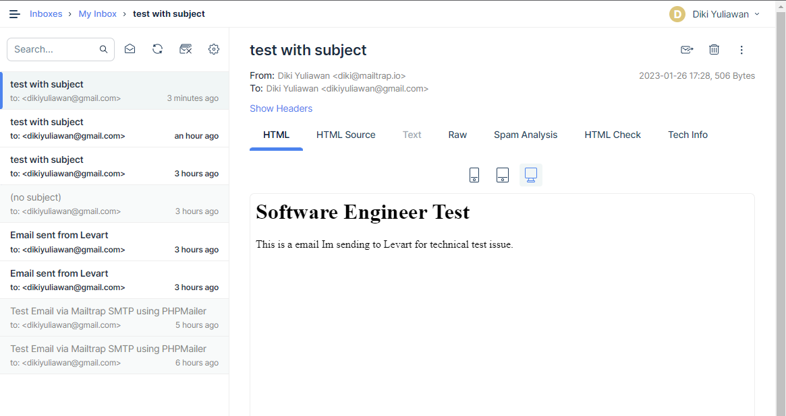

# Send Email API

# How to set up application

- Cloning git on this repository
- Start Apache & Sql Server (e.g Xampp, Mampp, Wampp, etc)
- Create database : levart
- Create/import table sent_email (file included)

# How to run application

- You need to authorize first before send email
- Enter url **localhost/levart/auth.php** on Postman with POST method
    

- Enter url **localhost/levart/restapi.php** on Postman with POST method
    condition if unauthorized
    
    
    successfully sent email
    

- Here's list of messages that successfully sent from api
    
